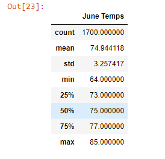
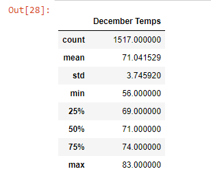
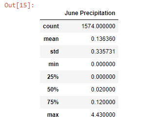
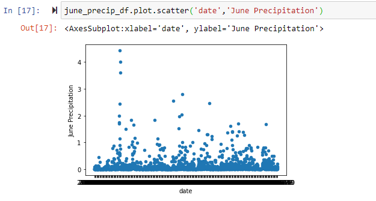
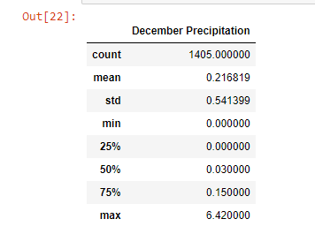
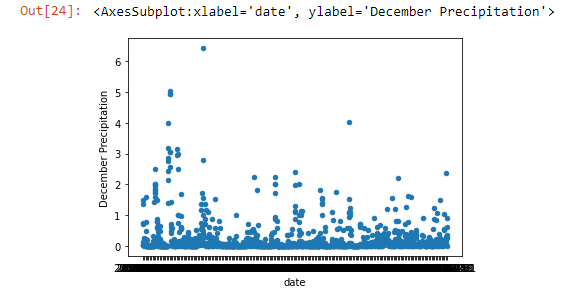

# Surfs_Up
Jupyter Notebook, Pandas, SQLite, and Flask
## Overview
The purpose of this analysis was to provide data on the weather and precipitation in Oahu, Hawaii to client W. Avy so that he could consider the location for the opening of an ice cream and surf shop. This data will help W. Avy determine whether or not his potential business venture would be profitable throughout the entire year.
## Results
The data utilized from this database contains weather data from 2010-2017. We filtered this data to show only the months of June (Deliverable 1) and December (Deliverable 2) to give W. Avy a better idea of what the extremes of the year may be weather-wise for summer and winter. The raw data was filtered, converted to lists, then converted to DataFrames after which a statistical analysis was performed to show the count, mean, standard deviation, min, quartiles, and max of each DataFrame. The results are show below.
### Deliverable 1

### Deliverable 2

### Analysis
* Point 1: The average temperature for June is 75 degrees, where as it is 71 degrees for December. This is a difference of only 4 degrees for perhaps the most stark juxtaposition between two seasons. In other parts of North America, the difference between seasons is far more noticeable.
* Point 2: The minimum temperature for June is 64 degrees, where as the minimum for December is 56 degrees. This is to be expected, as December tends to yield lower temperatures in North America, however 56 degrees is not so cold that one would not be able to enjoy ice cream. If that is the lowest temperature of the year, an ice cream shop would do well year-round.
* Point 3: The maximum temperature for June is 85 degrees, wehre as the maximum temperature for December is 83. This is ideal weather for surfing or for ice cream, with only a two degree difference between Summer and Winter. 
## Summary

It is my recommendation, given the above, that W. Avy moves forward with opening an ice cream and surf shop in Oahu, Hawaii. The temperature is between 56 and 85 degrees year-round, which is optimal for both ice cream and surfing. I wanted to also examine the precipitation data for these months as to provide W. Avy a more thorough view of weather conditions. I accomplished this by filtering for precipitation data for June and December, coverting to lists, converting to DataFrames, performing a statistical analysis, then setting the date as the index, sorting by index, and then plotting the data to reveal any outliers.[The code for the two additional queries can be viewed here.](Additional_Queries.ipynb)
### Additional Query 1

I performed this query to see how much rainfall is experienced in the month of June. As show above in the statistical analysis, the average rainfall per day in June is 0.136 inches. The max rainfall in June was listed as 4.43 inches, so I decided to utilize a scatter plot to show any outliers.

As shown above, it is clear that most data points fall below the 1 inch mark, with a few outliers. It is my opinion that the rainfall in June is minimal enough that it would not affect the potential success of the proposed surf and ice cream shop. 
### Additional Query 2

I performed this query to see how much rainfall is experienced in the month of December. As shown above in the statistical analysis, the average rainfall per day in December is 0.217 inches. Although higher than June, it is still below a quarter of an inch per day. As above for the June analysis, I recognized that thge maximum rainfall for December (6.42 inches) was quite high, so I decided to utilize a scatter plot to see if it was an outlier.

As shown above, rainfall above 6 inches is most certainly an outlier, as most daya points fall at or below the 2 inch mark. Although December would be rainier than June, it is still my recommendation to open the surf and ice cream shop in Oahu, as the weather data points to the potential for great success. 
